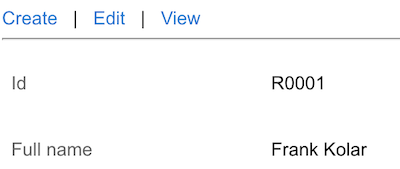
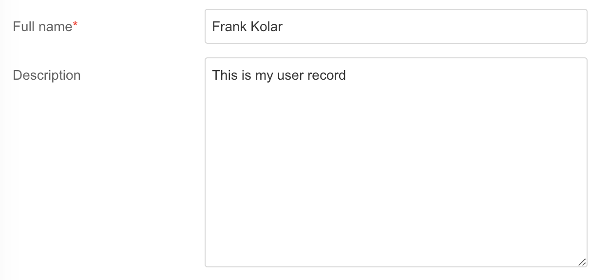
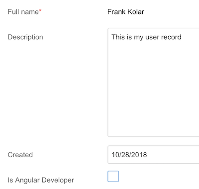
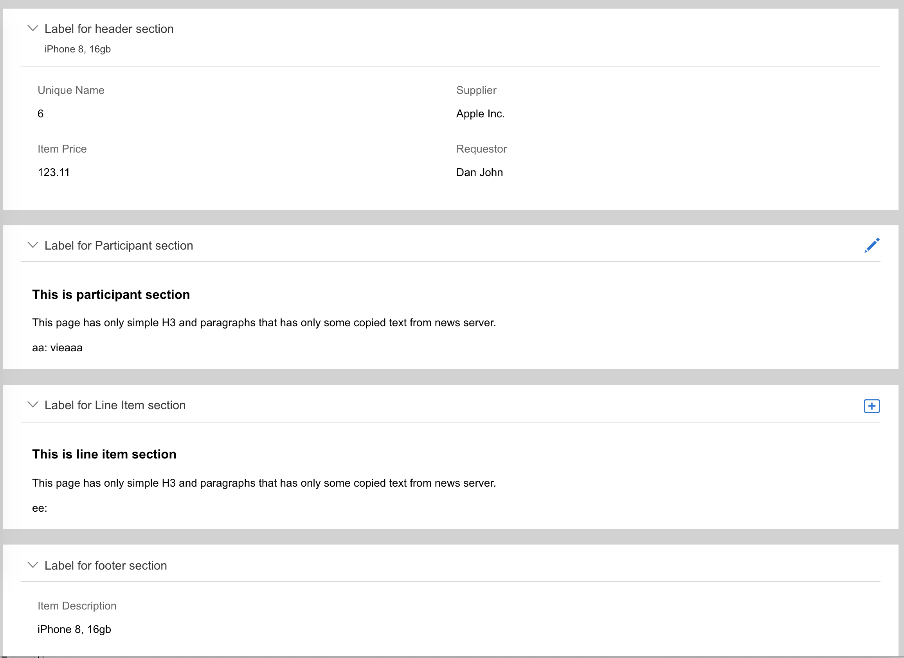

## OSS Rules and MetaUI Application

In this section we will extend our application from the [getting started guide][1] where a simple page was generated and also cover more 
advanced aspect behind all this in following sections:


Before we get into how to use OSS, lets start with a [quick overview of the syntax][6] and its similarities and 
differences to other syntaxes you may know already.

* [Extend MetaUI Applications](#extend-metaui-applications)
* [Rules](#rules)
* [Context and Properties](#context-and-properties)
* [Chaining](#chaining)
* [Built-in Rules](#built-in-rules)
* [Application Rules](#application-rules)
* [Rule Loading](#rule-loading)
* [Rule Ranking](#rule-ranking)
* [Visibility](#visibility)
* [Validation](#validation)
* [Editibility](#editibility)
* [Actions](#actions) 
* [Layouts](#layouts)
* [Other Areas to Explore](#other-areas-to-explore)


#### Extend MetaUI Applications

Let's add two more fields on the `User.ts` object from the getting started guide:

```ts

constructor(public uniqueName?: string, public name?: string,
              public description?: string, public created?: Date,
              public age?: number, public isAngularDeveloper: boolean = false) {
  }


```

We want to keep it relatively simple so we added fields `age` and `isAngularDeveloper`. Let's also add type definition so 
rules can properly introspect these fields.


```ts

  getTypes(): any {
    return {
      uniqueName: String,
      name: Number,
      description: String,
      created: Date,
      age: Number,
      isAngularDeveloper: Boolean
    };
```

and extend our rule file `app/rules/User.oss` which tells the framework how and where these new fields 
should be rendered. Let's show these field in `create` operation and default one which is `view`

```ts

  class=User {
  
        field=uniqueName {
             label:"Id"
        }
  
         field=name {
             label:"Name"
         }
  
         field=description {
             trait:longtext;
         }
  
         zNone => *;
         zLeft => uniqueName => name => description => created => age => isAngularDeveloper;
  }
  
  /*
    Sample definition for operations edit and create
  
  */
  class= User {
     operation=(edit, create) {
        zNone => *;
        zLeft => name => description;
     }
  
    operation=(create) {
        zNone => *;
        zLeft => name => description => created => isAngularDeveloper;
     }
  
  }
```

and also extend a component constructor where we instantiate `User`
```typescript

 this.object = new User('R0001', 'Frank Kolar', 'This is my user record', new Date(),  20, true);

```
 

let's recompile and look at the application again

```ts
  npm run compile:oss
  ng serve 

```
You can also run `npm run watch:oss` that monitors any `oss` changes and recompile automatically.


### Rules

Here we are getting to the first topic the **Rules**. As you can see to add additional two fields we did not do much. 
You extend only the domain object `User` and update a rule file just like you do with your css.

A _Rule_ defines a map of properties that should apply in the event that a set of Selectors are matched. 
Given a rule base Meta and a set of asserted values Context a list of matching rules can be computed 
(by matching their selectors against the values) and by successively (in rank / priority order) 
applying (merging) their property maps, a set of effective properties can be computed. 


Each rule can be stated like this:

```ts
If selectors [__,__,...] match the current context values,
then apply the properties [__,__,...].
```

These rules can come from a variety of sources:

* **Runtime introspection of Typescript classes**
    
    These rules declare the available properties (fields)  along with their data types. 
    
    _Example: "What are the fields in the `User` class?" In rules term:_
    

```ts
  If selectors [class=User, declare=field]
      match the current context values,
  then apply the properties
      [field:name]
  
  
  If selectors [class=User, declare=field]
      match the current context values,
  then apply the properties
      [field:isAngularDeveloper]
            
  ...    
```    

  Since typescript (javascript) does not offer proper reflection support so we can introspect a class 
  the `getTypes()` method exists.


* **Built-in rules**

  MetaUI includes a base set of rules (`WidgetsRuels.oss`) to describe, for instance, a mapping from field 
  data type to UI component. Example: "If it's a Boolean (`isAngularDeveloper`) and we're editing, use 
  the Checkbox component." 
  
  In rules term:
  

```ts
  If selectors [field=any, type=Boolean, editable=true]
      match the current context values,
  then apply the properties
      [component:CheckboxComponent]
```  


* **Application provided rules**

  Applications may provide explicit rules via "object style sheet (oss) files" (`User.oss`). These are a convenient 
  place to express presentation-oriented rules that really don't belong in (UI agnostic) domain classes. 
 
  
  Example: "The description field should appear after name field." In rules term:
  
```ts
  If selectors [class=User, field=description]
      match the current context values,
  then apply the properties
      [after:name]
```  

In our example you could see OSS syntax in form of (description goes after name):

```ts
zLeft => uniqueName => name => description => created => age => isAngularDeveloper;
```

or can be expressed as:

```ts
class=User {
     field=description {
         after: name;
     }
```

* **Other Sources of Meta Data**

  Many applications have other external sources of information about the application's 
  domain classes. For instance, an application may have meta data comming from Rest API 
  that provide additional information about classes and fields that should be taken into account
  when creating user interfaces (e.g. "is this field an owned to-many relationship?"). MetaUI provides generic 
  hooks for integrating such sources of metadata (in fact, the metadata sources above 
  integrate via these same hooks).
      
  
We'll go into more details for each type of rules, but for now let's take a look at context and properties...

   
   
### Context and Properties

Context represents a stack of assignments (e.g. [object]="user", operation="create", layout="Inspect"). 
The current values are run against the Meta rule set to compute the effective property map.
The property map holds property key/value pairs that directly affects the UI (eg, component="CheckboxComponent", editable="false")

This is similar to how CSS works. HTML elements can have classes to provide context. For example:

```html

  <div class="box">
      <h1>Hey</h1>
  </div>
  
  <div class="X">
   <div class="box">
      <h1>There</h1>
   </div>
  </div>
```
Then you have rules that depending on the context and how they are nested, you get different styling properties:

```css

  .box {
     border:1px solid red;
     width:100px;
     float:left;
     color:green;
  }
  /*
     if an element with class "box" that is contained
     in an element with class "X",
     then applies these properties
  */
  .X .box {
      border:3px solid blue;
      background-color:yellow;
  }
  /*
     if a h1 element is contained
     in an element with class "box" that is contained
     in an element with class "X",
     then applies these properties
  */
  .X .box h1 {
      color:orange;
  }
```


If multiples rules match, properties are merged and overridden. In this example,the "There" element 
merged the width and float properties, but overrode the border and color properties from more specific rules.


In MetaUI, context values are set using `MetaContextComponent`:

```html
  <m-context [object]="user" operation="create" layout="Inspect">
      <m-include-component></m-include-component>
  </m-context>


  <m-context [object]="user" operation="view" layout="Inspect">
        <m-include-component></m-include-component>
  </m-context>
```

Then you have rules that depending on the context and how they are nested, you get different UI properties:

```ts
  If selectors [operation=create, field=any]
      match the current context values,
  then apply the properties
      [editing:true]
  
  If selectors [operation=view, field=any]
      match the current context values,
  then apply the properties
      [editing:false]

```

`MetaIncludeComponent` and various Meta components takes the effective property map to generate 
programatically the UI.


and view operation: 


##### Here are some interesting context keys:

* **module**: Global nav tab
* **layout**: Define a named layout (e.g. "Inspect", "SearchForm")
* **operation**: "view", "edit", "create", "search", "list"
* **class**:  Class name
* **object**: Object instance (e.g. a User object)
* **action**: An action (e.g. could be fired from a button)
* **field**: Current field of class
* **elementType**: If type is collection, the type of its elements
* **editing**: Currently editing? Derived from operation
* **trait**: Current traits in effect (like CSS classes)

##### Here are some interesting property keys:

###### General

* **trait**: List of traits to apply
* **after**: Name of item (or zone) that this item should follow (for layout order)
* **visible**: Should current item be shown
* **component**: Component name to use for display
* **bindings**: Map of bindings to pass to component
* **wrapperComponent**: Name of component to wrap around this component (also, wrapperBindings)


###### Class

* **fieldsByZone**: Map of List<Fields> for the layout zones (e.g. "zTop", "zLeft", …)
* **zonePath**: Zone key path for sub map to render
* **zNone**: Special zone which makes field invisible
* **zLeft**: Specific named zone that renders fields in the Left zone (the same applies for other zones: zRight, zBottom, zMiddle, zTop)


###### Layout, Module, Field, Action

* **label**: Display key 
 
###### Field

* **editable**: Should current field be editable
* **valid**: Is current value valid


###### Layout

* **layoutsByZone**: List of sub-layout names grouped by zone (zTop, zLeft, …)


###### Action

* **actionResults**: Executes js code that can fire any action


Here are some of the interesting context keys that are explicitly set into the context:

* **field**: set by MetaFormTableComponent
* **action**: set by MetaActionListComponent
* **actionCategory**: set by MetaActionListComponent
* **class**: set by MetaFormTableComponent
* **object**: set by MetaFormTableComponent
* **layout**: set by MetaFormTableComponent MetaSectionComponent, MetaDashboardLayoutComponent
* **module**: set by MetaHomePage


However, some are implicitly set by the MetaUI engine. It's time to talk about chaining...


### Chaining

Chaining is when some properties resulting from one rule are fed back as new context assignments, 
resulting in new matches.

These context assignments are "implied" by the current assignments are applied, (resulting in a revised 
computation of the current property map, and possible further chaining).

Referring to the rules listed below, we can see how this particular chaining sequence happens:

* The `field=isAngularDeveloper` value is assigned into the context by MetaFormTableComponent and activates rules 1 - 5.
* The `type` property from rule 1 is chained/implicitly assigned backed into the context and activates rules 4 and 5.
* The `editing` property from 2 is chained/implicitly assigned backed into the context and activates rule 3.
* The `editable` property from 3 is chained/implicitly assigned backed into the context and activates rule 4.


```ts
1) If selectors [class=User, field=isAngularDeveloper]
       match the current context values,
   then apply the properties
       [type:Boolean]


2) If selectors [operation=create, field=any]
       match the current context values,
    then apply the properties
        [editing:true]


3) If selectors [field=any,editing=true]
       match the current context values,
   then apply the properties
       [editable:true]


4) If selectors [field=any, type=Boolean, editable=any]
       match the current context values,
   then apply the properties
       [component:CheckboxComponent]


5) If selectors [field=any, type=Boolean]
       match the current context values,
   then apply the properties
       [bindings: {value=value}]

```

Not all properties are chained. The following are some of the interesting properties that are chained:

* class
* type
* elementType
* trait
* editable
* editing
* layout
* component

You should now have a sense of the power of rule based UI. Most of the rules to generate the UI are 
already available from the domain object, or are conventions that are redundant to repeat. We don't need 
to worry about updating all the areas every time we add/remove/change a field.

**Let's extend our example**

Let's add proper label _"Full name"_ for `name` field like this in the `User.oss`:

```ts
class=User {

  field=name {
     label:"Full name"
  }
  ...
```


```
Note: Don't forget to run "npm run compile:oss" when you modify OSS rule file unless you launched in the other 
terminal "npm run watch:oss" command
```


We just defined new selectors for [class=className, field=fieldName]. So in our example, this rule was created:

```ts
If selectors [class=User, field=name]
    match the current context values,
then apply the properties
    [label:"Full name"]
```





We can similarly add `trait` properties like this:

```ts
class=User {

  field=name {
     label:"Full name";
     trait:required;
  }    
  field=description {     
       trait:longtext;
  }  
  ...
```


The following rule is created:

```ts
  If selectors [class=User, field=name]
      match the current context values,
  then apply the properties
      [trait:required]
      
  If selectors [class=User, field=description]
      match the current context values,
  then apply the properties
      [trait:longtext]    

```

Now the _name_ field is required and description changed from simple text text field to text area.


<p width="10px">



</p>
We've discussed how `MetaIncludeComponent` switches in the right component with the 
component property through chaining. As mentioned, the trait property is chained 
back to the context, but where are the rest of rules involved? This takes us to 
the MetaUI built-in rules.


### Built-in Rules

An important source of built-in rules are specified in `WidgetsRules.oss`. In this file, 
you will find many useful rules for data type, decoration, trait, operation, layout, action, 
and module in OSS. In particular, you will find these nested OSS rules:

```ts
field {
     type=java.lang.String {
        @trait=longtext {
           after:zBottom;
           editable { component:TextAreaComponent;
             bindings:{cols:60; rows:10} }
           ....
       }
```

We'll cover the OSS syntax in more details in a different tutorial, but this is one of the rules:

```ts
  If selectors [field=any, type=String,
                trait=longtext, editable=true]
      match the current context values,
  then apply the properties
      [component:TextAreaComponent]
```


### Application Rules

Since we have already `User.oss` in the `app/rules` directory we are going to add following

```ts
       field=age  editable=false {
          component:AgeRatingComponent;
          bindings: {
            value:$value;
          }
       }
```

The `AgeRatingComponent` might look like this


```ts
  import {Component, Input, OnInit} from '@angular/core';
  import {BaseComponent, Environment} from '@ngx-metaui/rules';
  
  
  @Component({
    selector: 'app-age-rating',
    template: `
      <span class="w-string-field">
        {{rating}}
      </span>
    `
  })
  export class AgeRatingComponent extends BaseComponent implements OnInit {
  
    @Input()
    value: any;
  
    rating: string;
  
    constructor(protected environment: Environment) {
      super(environment);
    }
  
    ngOnInit(): void {
      this.rating = (!this.value) ? 'N/A' : ((this.value && this.value <= 20) ? 'Young' : 'Good');
    }
  }
```

And dont forget to add this into your module `declarations` as well as `entryComponents` since all is assembled 
programmatically

```ts
  @NgModule({
    declarations: [
      AppComponent,
      UserDetailComponent,
      AgeRatingComponent
    ],
    imports: [
      BrowserModule,
      BrowserAnimationsModule,
      MetaUIRulesModule.forRoot({})
    ],
    entryComponents: [AgeRatingComponent],
    providers: [],
    bootstrap: [AppComponent]
})

```

To help the introspection when MetaUI tries to instantiate `AgeRatingComponent`the type must be known. For this
we are going to add export into `user-rules.oss`


```ts
/**
 * Export generated TS files from ./ts directory
 */

export * from './ts/DummyOSS';

/** Auto generated  export */
export * from './ts/UserOSS';

export * from '../age-rating/user-detail.component';
```


Recompile oss, serve and let's change age from 20 to 30


and in read-only mode the value renders as _Good_


And with that, we just overrode the default component property. To see how MetaUI determine how 
properties from multiple rules are applied, we need to understand how rules are loaded and ranked...


### Rule Loading

On application initialization:

* Built-in `WidgetsRules.oss` rules are loaded. Build-in rules are already precompiled and are part of the _@ngx-metaui/rules_
* If global application rule exists the `Application.oss` then its loaded  and there can only be one for the entire application.  
* On first reference to class name in the MetaUI context:
  * Introspection rules are created and they are loaded from `app/rules/[EntityNamne].oss`
  
To load rules the `RuleLoaderService` is used.  
  


### Rule Ranking

* Matching rules are applied in rank order to build the property map.
* Rules from system (default rules) have lowest rank, then introspection rules, then application `.oss` rules.
* Rank is (roughly) the order of appearance in the .oss file (later == higher rank)
* When multiple rules update the same property, type and key-specific merge rules are applied:
  * Maps and trait lists are merged
  * visible, editable, and valid expressions are chained with AND semantics (except if override value is used - `e.g. visible=true!`)
  * Other values are overridden
  

### Visibility

Let's continue by adding some advanced rules. We want to hide the description field when we are not editing and 
isAngularDeveloper is false with the visibility property


```ts
field=description {
     trait:longtext;

     editing=false {
        visible: ${object.isAngularDeveloper};
     }
}
```

which creates this rule:    
    
```ts
If selectors [class=User, field=description, editing=false]
    match the current context values,
then apply the properties
    [visible:${object.isAngularDeveloper}]
```    

Expressions are wrapped in `${…}` and when used in property value, the "this" is the Context object - key
paths reference assignments in context


**The context also has special keys for the following:**

* **object**: The current object instance set on the context by the object context key
* **value**: The field value from evaluating the current field on the current object in the context
* **properties**: The current property map access as `properties.get('<property name>')`


### Validation

Next we add a validation on the `created` field to ensure that it's not a future with the `Validation` condition:


```ts
   field=created {
      valid:${ object.isValidCreateDate() ? true : "The date cannot be in the future" };
   }
```


and let's add our validation method to domain object `user.ts`:

```typescript
  isValidCreateDate(): boolean {
    const dateNow = new Date();
    return (this.created && this.created < dateNow);
  }
```

which creates this rule:

```ts
  If selectors [class=user, field=created]
      match the current context values,
  then apply the properties
      [valid:${object.isValidCreateDate()}]
```


When you select future date our custom error message appears


### Editibility

Let's add a rule to prevent the editing the `name` field if the value `isAngularDeveloper` is  not true. 

```ts
     field=name {
         label:"Full name";
         trait:required;
         editable: ${object.isAngularDeveloper};
     }
```

which creates this rule:

```ts
If selectors [class=User, field=name]
    match the current context values,
then apply the properties
    [editable:${object.isAngularDeveloper}]
```

Select _create_ operation and uncheck `isAngularDeveloper` and we see that it the `name` (Full name) is not editable.




### Actions

Action is the way how to add some logic into your MetaUI. For example:

* Show a message dialog
* Trigger routing
* Or run some typescript/javascript code

Let's add an action on the `User.oss` that shows only in editing mode and  when clicked it opens an alert 
with the `object.name`:

```ts
  class {   
    @action=Save  {
         label: "Save";
         actionResults:${ alert("Record saved : " + object.name) };
         visible: ${properties.get("editing")};
         buttonStyle:info;
    }
  }

```

To be able to see the action let's change our `layout` binding to the `InspectWithActions` inside our
`user-detail.component.html`, so it could
look like this:

```html
  <m-context [object]="object" [operation]="operation" layout="InspectWithActions">
    <m-include-component></m-include-component>
  </m-context>
```

You can define different variety of layouts but more about this in the next section.

which creates this rule:

```ts
If selectors [class=User declare=action]
    match the current context values,
then apply the properties
    [action:Save]

If selectors [class=User, action=Save]
    match the current context values,
then apply the properties
   [actionResults:${
           /*
              - Run JS code that shows alert
              - Use an object to access a name              
           */
           }
       ]

```

When in editing mode the actions appears under action button placeholder.


     

When clicked our message appears in alert dialog:


Other way to insert an `Action` we don't necessary need to change the layout we can keep the existing `Inspect` layout
and use other `m-context` element and render actions like this:


Let's extend our rules to:


```ts
/*
  Sample definition for operations edit and create

*/
 class= User {
   operation=edit {
      zNone => *;
      zLeft  => name => description => age;
   }

  operation=create {
      zNone => *;
      zLeft => name => description => created => isAngularDeveloper;
   }

   @action=Save  {
        label: "Save";
        actionResults:${ alert("Record saved !") };
        visible: ${properties.get("editing")};
        buttonStyle:info;
   }

   @action=Discard  {
         label: "Discard Changes";
         actionResults:${ alert("All cleared !") };
         visible: ${properties.get("editing")};
         buttonStyle:info;
   }
}
```

We just defined 2 actions on the class user and we can insert them to the page this 
like this:

```html
  <span style="float: right">
    Actions: [
    <m-context [object]="object"  layout="Links">
      <m-include-component></m-include-component>
    </m-context>
  ]

  </span>


  <m-context [object]="object" [operation]="operation" layout="Inspect">
    <m-include-component></m-include-component>
  </m-context>
```


When discard is clicked:


### Layouts

So far we discussed how domain objects are rendered, we covered some advanced topics like conditions and 
actions and all this is nothing without layouts. 

Layouts are a like containers in MetaUI and they form high level structure in which you place your content.
Even our form from above is backed up by layout:

```ts
class layout=Inspect { 
  trait:Form; 
  label:${UIMeta.beautifyClassName(values.class)}; 
}

@trait=Form { visible:true; component:MetaFormComponent }
```

In MetaUI we have two types of containers:
* module
* layout

`Module` is just another container that can use multiple layouts to assemble actual page and it used
to generate top level navigation menu where each menu have its own content


Let's define 3 tabs:
 
```ts
@module=Home {
    label:"My Home";
    pageTitle:"You are now on Homepage";

    @layout=Today {
       after:zTop;
       label: "Sales Graph";
       component:SalesGraphComponent;
    }

    @layout=Sport {
       after:Today;
       label: "Sport today!";
       component:StringComponent;
       bindings:{value:" ...... " }
    }


     @layout=Tech {
           after:Sport;
           label: "Tech News";
           component:StringComponent;
           bindings:{value:" ...... " }
     }

     @layout=MessageBoard {
        after:zBottom;
        label: "Message Board";
        component:StringComponent;
        portletWidth:large
        bindings:{value:" ...... " }
     }

}


@module=Products {
    pageTitle:"You are now on Products";
    homePage:ProductContentComponent;
}


@module=Sources {
    label:"Sources for Module";
    homePage:SourcesComponent;

}
```


Module is defined like this:

```ts
module {
    homePage:MetaHomePageComponent;
    component:MetaDashboardLayoutComponent;
    layout { visible:true }   
}
```

Every module is rendered on top of the `component` property (in this case `MetaDashboardLayoutComponent`) 
and uses `homePage`to render given content. In `@module=Home` we defined 4 layouts and distributed
them to different zones which are implemented by `MetaDashboardLayoutComponent`.
Other tabs overrode `homePage` and added regular angular component.

Layouts can in turn contain other layouts or object layouts and action layouts. Like our example from above where
changed layout binding to `InspectWithActions` because we needed to have a container that can hold and render actions:

```ts
layout=InspectWithActions {
    trait:Stack;
    @layout=Actions#ActionMenu;
    @layout=Inspect#Form;
}
```

In above build-in rule  we defined a layout `InspectWithActions` with `trait` Stack, which adds additional properties such `component`
that knows how to render its content in actual _stack_. And we have two named `@layout` where one creates a container 
for actions and another renders a Form.

Similar way you can construct any kinds of layouts. Here is an example from different context. Let's create a generic
layout for `Invoice` class where we want to have expandable sections and each section will have its own content.





all defined with the rule:

```ts
layout=InvoicePage#Sections {
    @layout=Header#Form {
        zonePath:Header;
        title:"Label for header section";
        description:$object.itemDescription;
        opened:false;
    }

    @layout=Participant {
        title:"Label for Participant section";
        visible:true;
        canEdit:true;
        component:Section2Component;
        editing {
            bindings:{
                oper:'editx';
            }
        }
        editing=false {
            bindings:{
                oper:'vieaaa';
            }
        }
    }

     @layout=Lines {
        title:"Label for Line Item section";
        visible:true;
        canEdit:true;
        editMode:"external";
        actionIcon:"icon-positive";
        component:Section3Component;
        bindings:{
            oper:${properties.get("operation")}
        }
    }
    @layout=Footer#Form {
        title:"Label for footer section";
        zonePath:Footer;
    }
}
```


with html code like this:

```html
  <m-context [object]="myRequest" operation="view" layout="InvoicePage"
                   (onAction)="onActionHandler($event)">
        <m-include-component></m-include-component>
   </m-context>
```

Fields are "zoned" by setting their predecessor with a dotted path (e.g. "header.zRight") that 
is establish as the "zonePath" for the nested form in the above ` @layout=Header#Form`

The application rule to render actual _Invoice_ could look like this:

```
class=Invoice {
    layout {
        trait:labelsOnTop;
    }
    Header.zLeft => uniqueName => itemPrice;
    Header.zRight => supplier => requestor;
    Footer.zBottom => itemDescription;
}
```


### Other Areas to Explore

So you've seen how `MetaUI` works with domain objects to generate various user interfaces derived from rules. The next steps could be 
to give it a chance and try it out and also look at the following:

* [Build-in rules][2]: Default rules where you can learn various oss constructions.
* [MetaContext][3]: Angular component `m-context` responsible for setting context and communicating with the rule engine.
* [MetaIncludeComponent][4]: Key component for reading final evaluated properties and rendering programatically UI.
* [Meta][5]: Base class rule engine implementation.  
* [OSS Grammar Tutorial][6]: Introduction to oss syntax  


[1]: ../GETTING-STARTED.md
[2]: https://github.com/ngx-meta/rules/tree/master/libs/rules/src/lib/metaui/core/oss
[3]: https://github.com/ngx-meta/rules/blob/master/libs/rules/src/lib/metaui/core/meta-context/meta-context.component.ts
[4]: https://github.com/ngx-meta/rules/blob/master/libs/rules/src/lib/metaui/layout/meta-include.directive.ts
[5]: https://github.com/ngx-meta/rules/blob/master/libs/rules/src/lib/metaui/core/meta.ts
[6]: https://github.com/ngx-meta/rules/blob/master/docs/oss-syntax.md


